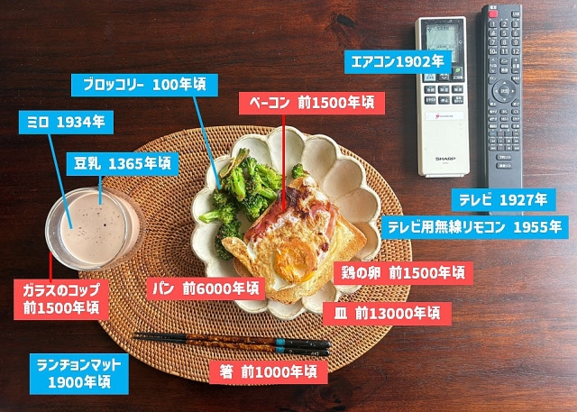

# history-annotator — 写真に「発明年」を注釈するエージェント

写真に写っている物体を判別し、各物体の **発明年 / 起源年** をWebで調べ、
引き出し線つきのラベルとして写真に焼き込むエージェント。



`001.jpg`（入力）→ `out/002.jpg`（注釈済み）のような加工を行う。

## 設計思想

「判別・調査（賢いが非決定的）」と「描画（正確だが機械的）」を分離する。

| 工程 | 担当 | 理由 |
|---|---|---|
| 物体の命名（細粒度・日本語） | Claude (Vision) | ミロ/豆乳/無線リモコンの粒度はVLMの独壇場 |
| キュレーション（何をラベルするか） | Claude | 意味のある物体の取捨選択 |
| 初期 anchor 座標（粗くてよい） | Claude | 一発精度は不要。後段で見て直す |
| 年代調査 | Claude (WebSearch) | 出典つきで取得＋キャッシュ |
| レイアウト・SVG生成・合成 | `render.py` / `layout.py`（決定論） | ピクセルはLLMに描かせない |
| **anchor 補正** | Claude が出力画像を見て修正→再描画 | ★検証は生成より易しく数回で収束 |

外部APIキーは不要（Claude Code 標準の Vision と WebSearch を使う）。
唯一のローカル依存は描画の `cairosvg` と日本語フォント。

## 使い方

### エージェントとして（推奨）
Claude Code で次のように依頼すると `history-annotator` サブエージェントが
判別→調査→描画→視覚QAループまで自動実行する:

> history/001.jpg を 002.jpg のように、写っている物の発明年を注釈して

### スクリプト単体（描画のみ・AI非依存）
判別結果を書いた `spec.json` があれば、描画だけを再現実行できる:

```bash
python history/render.py history/001.jpg history/out/spec.json history/out/002.jpg
```

`spec.json` の `anchor` / `year` / `side` を手で直して再実行すれば、
**再クエリ無し**で描き直せる。

## 依存

```bash
pip install cairosvg pillow
```

- 日本語フォント: Windows の **Meiryo** を自動利用。
  `history/fonts/NotoSansJP-Bold.ttf` を置けばそちらを優先（同梱推奨だが任意）。
- `cairosvg` は Cairo ネイティブを使うが、`pip install` で導入される
  `cairocffi` 同梱バイナリで Windows でも動作確認済み。

## ファイル構成

```
history/
  001.jpg              入力サンプル
  002.jpg              完成見本（上書き禁止）
  render.py            spec+画像 → SVG合成CLI（決定論・AI非依存）
  layout.py            ラベル配置・引き出し線・SVG生成
  fonts/               日本語フォント（任意。無ければ Meiryo）
  cache/years.json     年代キャッシュ（パン/卵 等の再検索省略）
  out/
    spec.json          判別・調査結果の中間生成物（編集可）
    002.jpg            生成画像
.claude/agents/
  history-annotator.md サブエージェント定義
```

## spec.json スキーマ

```json
{
  "image": "001.jpg",
  "objects": [
    {"label": "ベーコン", "kind": "食材", "year": "前1500年頃",
     "anchor": [0.55, 0.50], "side": "right",
     "source": "https://en.wikipedia.org/wiki/Bacon"}
  ]
}
```

- `anchor`: 引き出し線が指す物体中心。正規化座標 `[x, y]`（0..1, 左上原点）。
- `side`: ラベルを置く辺。`"left"` / `"right"` / `"bottom"`。
- `kind`: `"製品"`（発明年）/ `"食材"`（起源年）。調査の問い方を変える。
- `year`: 表示文字列（`前1500年頃` / `1927年` など日本語整形済み）。
- `source`: 出典URL（任意・検証用）。
