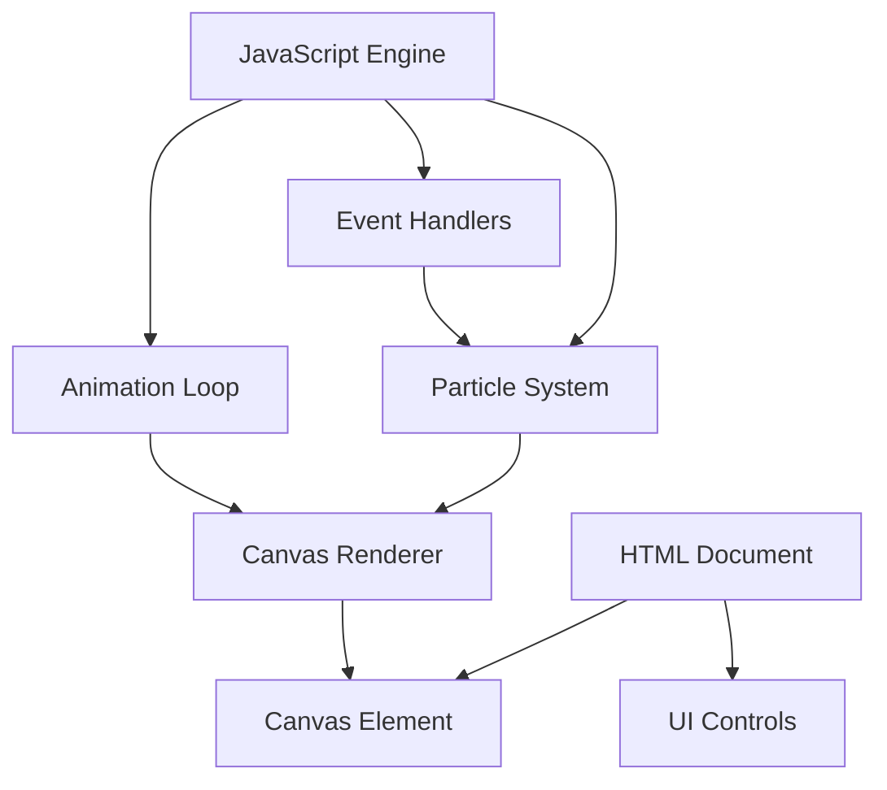

# Design Document

## Overview

Kiro Inspired Webアプリケーションは、「輝き」をテーマにしたインタラクティブなビジュアルエクスペリエンスを提供します。ユーザーのクリック操作に応じて、画面上に美しい光のパーティクルエフェクトを生成します。HTML5 Canvasを使用してパーティクルシステムを実装し、純粋なJavaScriptでアニメーションロジックを制御します。

## Architecture

アプリケーションは3つの主要レイヤーで構成されます：

1. **Presentation Layer (HTML/CSS)**: UIの構造とスタイリング
2. **Rendering Layer (Canvas)**: パーティクルの描画とビジュアルエフェクト
3. **Logic Layer (JavaScript)**: イベント処理、パーティクル管理、アニメーションループ



## Components and Interfaces

### 1. Particle Class

パーティクルの個々のインスタンスを表現します。

```javascript
class Particle {
  constructor(x, y, color, velocity, size)
  update(deltaTime)
  draw(context)
  isDead()
}
```

**Properties:**
- `x, y`: 現在位置
- `vx, vy`: 速度ベクトル
- `color`: RGB/RGBA色
- `size`: パーティクルのサイズ
- `life`: 残りライフタイム（0-1）
- `decay`: ライフタイムの減衰率

### 2. ParticleSystem Class

パーティクルの集合を管理します。

```javascript
class ParticleSystem {
  constructor()
  createEffect(x, y)
  update(deltaTime)
  draw(context)
  clear()
}
```

**Methods:**
- `createEffect(x, y)`: 指定位置に新しいパーティクルエフェクトを生成
- `update(deltaTime)`: すべてのパーティクルの状態を更新
- `draw(context)`: すべてのパーティクルをCanvasに描画
- `clear()`: すべてのパーティクルを削除

### 3. Application Controller

アプリケーション全体のライフサイクルを管理します。

```javascript
const App = {
  init()
  setupCanvas()
  setupEventListeners()
  animate(timestamp)
  handleClick(event)
  handleClear()
}
```

## Data Models

### Particle Data Structure

```javascript
{
  x: Number,           // X座標
  y: Number,           // Y座標
  vx: Number,          // X方向速度
  vy: Number,          // Y方向速度
  color: String,       // RGBA色文字列
  size: Number,        // パーティクルサイズ（ピクセル）
  life: Number,        // 残りライフ（0.0 - 1.0）
  decay: Number        // 減衰率
}
```

### Color Palette

輝きをテーマにした色パレット：

```javascript
const COLORS = [
  'rgba(255, 223, 0, ',   // 黄金色
  'rgba(255, 193, 7, ',   // 黄色
  'rgba(255, 152, 0, ',   // オレンジ
  'rgba(255, 255, 255, ', // 白
  'rgba(255, 235, 59, '   // 明るい黄色
]
```

## Correctness Properties

*A property is a characteristic or behavior that should hold true across all valid executions of a system-essentially, a formal statement about what the system should do. Properties serve as the bridge between human-readable specifications and machine-verifiable correctness guarantees.*


Property 1: Click generates particles at position
*For any* valid click coordinates within the canvas bounds, creating an effect at those coordinates should result in particles being generated at that position
**Validates: Requirements 1.1**

Property 2: Effects create multiple particles
*For any* effect creation, the number of particles generated should be greater than one, ensuring a radiating effect
**Validates: Requirements 1.2**

Property 3: Particles animate with motion and decay
*For any* particle, after calling update(), the particle's position should change (due to velocity) and its life value should decrease
**Validates: Requirements 1.3**

Property 4: Particles use warm color palette
*For any* generated particle, its color should be one of the predefined warm tones (yellow, gold, orange, white)
**Validates: Requirements 2.1**

Property 5: Effects have color variety
*For any* effect with multiple particles, not all particles should have identical colors, ensuring visual depth
**Validates: Requirements 2.3**

Property 6: Clear removes all particles
*For any* particle system state, calling clear() should result in zero active particles
**Validates: Requirements 4.2**

## Error Handling

### Canvas Initialization Errors

- **Issue**: Canvas element not found or not supported
- **Handling**: Display fallback message to user indicating browser incompatibility
- **Recovery**: Graceful degradation with error message

### Invalid Click Coordinates

- **Issue**: Click events outside canvas bounds
- **Handling**: Validate coordinates before creating effects
- **Recovery**: Ignore invalid clicks silently

### Animation Frame Errors

- **Issue**: requestAnimationFrame not supported
- **Handling**: Fall back to setTimeout with fixed interval
- **Recovery**: Reduced performance but functional

### Memory Management

- **Issue**: Too many particles causing performance issues
- **Handling**: Automatically remove dead particles (life <= 0)
- **Recovery**: Maintain particle count within reasonable limits

## Testing Strategy

### Unit Testing Approach

Unit tests will verify specific behaviors and edge cases:

- **Particle lifecycle**: Test particle creation with specific parameters
- **Color validation**: Verify colors are from the valid palette
- **Boundary conditions**: Test with zero particles, maximum particles
- **Clear functionality**: Verify clear button removes all effects
- **DOM structure**: Verify required HTML elements exist

### Property-Based Testing Approach

Property-based tests will verify universal properties across many random inputs using **fast-check** library for JavaScript:

- **Property 1-6**: Each correctness property will be implemented as a property-based test
- **Test configuration**: Minimum 100 iterations per property test
- **Generators**: Custom generators for coordinates, colors, particle states
- **Tagging**: Each test tagged with format: `**Feature: kiro-inspired-webapp, Property {N}: {description}**`

### Integration Testing

- **End-to-end flow**: Simulate user clicking and verify particles appear
- **Multiple effects**: Test simultaneous effects don't interfere
- **Clear and recreate**: Test clearing and creating new effects works correctly

### Manual Testing

- **Visual verification**: Ensure effects look smooth and appealing
- **Cross-browser**: Test in Chrome, Firefox, Safari, Edge
- **Responsive design**: Test on different screen sizes
- **Performance**: Verify smooth animation at 60fps with multiple effects

## Implementation Notes

### Performance Optimization

1. **Particle pooling**: Reuse particle objects instead of creating new ones
2. **Dead particle removal**: Remove particles with life <= 0 from array
3. **Canvas clearing**: Use clearRect() efficiently
4. **RequestAnimationFrame**: Use for smooth 60fps animation

### Browser Compatibility

- Target modern browsers with Canvas support (Chrome 4+, Firefox 2+, Safari 3.1+, Edge 12+)
- No polyfills needed for core functionality
- Graceful degradation for older browsers

### File Structure

```
kiro-inspired-webapp/
├── index.html          # Main HTML file
├── styles.css          # Styling
└── script.js           # JavaScript logic
```

### Animation Loop

Use requestAnimationFrame for smooth animation:

```javascript
function animate(timestamp) {
  const deltaTime = timestamp - lastTime;
  lastTime = timestamp;
  
  // Clear canvas
  ctx.clearRect(0, 0, canvas.width, canvas.height);
  
  // Update and draw particles
  particleSystem.update(deltaTime);
  particleSystem.draw(ctx);
  
  // Continue loop
  requestAnimationFrame(animate);
}
```

### Particle Physics

- **Initial velocity**: Random radial direction with varying speeds
- **Gravity**: Optional downward acceleration
- **Friction**: Gradual velocity reduction
- **Life decay**: Linear or exponential decay over time
